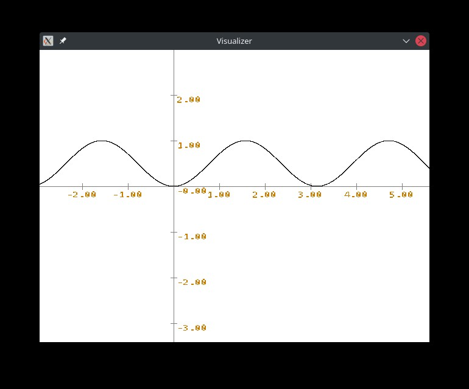
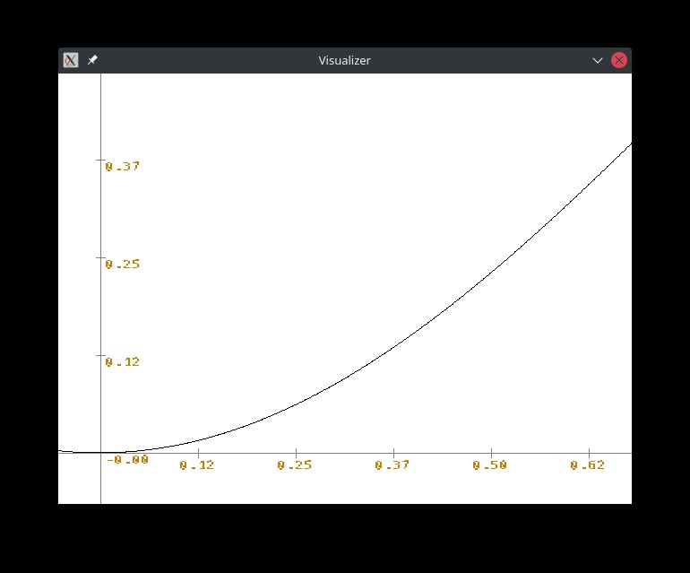
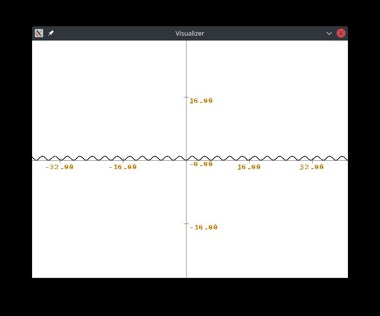
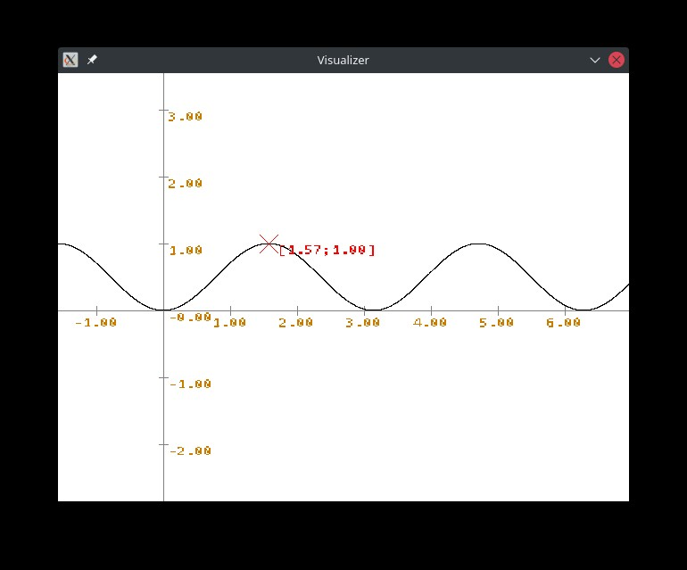

# Visualizer

This is a very simple function visualizer built with SDL2. It can show any function defined in the [Function.cpp](Function.cpp) file. 

## Controls
To move around the graph use the left mouse button. 
To zoom the graph use the scroll wheel. 
To highlight a point use the right mouse button. To un-highlight double-click the right mouse button on the same spot. 

## Customization
You can alter the behaviour of the Visualizer by changing the values defined at the beginning of [main.cpp](main.cpp) and compiling.

## Compiling
To compile this application yourself you will need the packages: libSDL2-2_0-0, libSDL2-devel, libSDL2_ttf-2_0-0, libSDL2_ttf-devel.
The default compiler is set to clang, however you can change this to gcc in the makefile.

## Running
To run the application you will need the packages libSDL2-2_0-0 and libSDL2_ttf-2_0-0.
Execute the application in the same folder where the [Hack-Regular.ttf](Hack-Regular.ttf) file is located. 

## Issues
 * Right now you have to "program" your desired function into Function.cpp.
 * The sampling does not dynamically scale with the zoom. This is sort of on purpose, as I wanted to see the imperfections created by sampling.
 * The offset_x and offset_y variables are inconsistent, which leads to some frustrating programming.
 * It is not ideal that the executable has to be in the same folder as the font. Idealy a font from the users computer would get loaded.

## Screenshots

